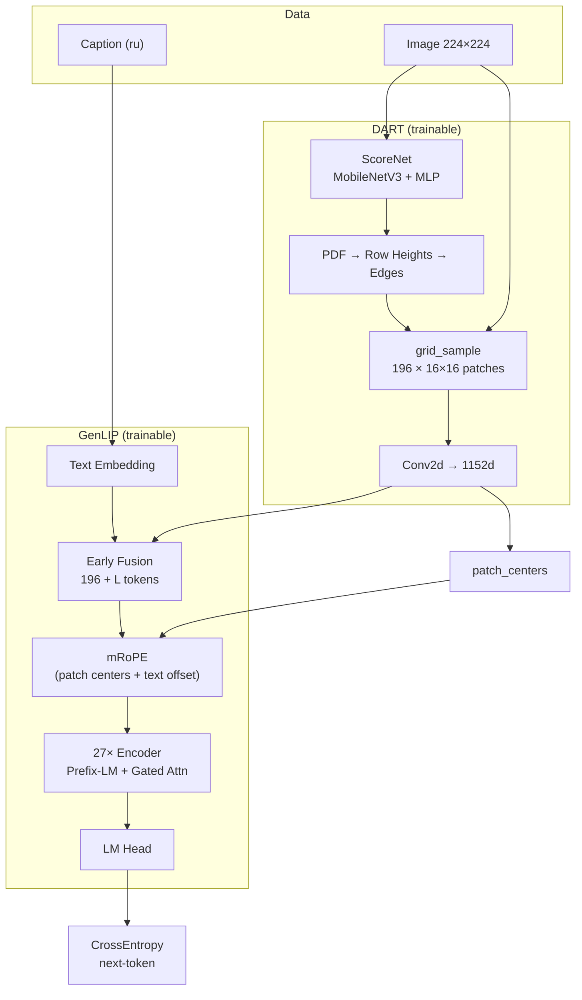

# FlowVLM: DART + GenLIP

Мультимодальная vision-language модель для image captioning. Визуальный энкодер **DART** (Dynamic Adaptive Resampling Tokenizer) извлекает **фиксированное** число патчей из изображения с content-aware нелинейной деформацией сетки, а **GenLIP** (Generative Language-Image Pretraining) объединяет vision-токены с текстом и обучается генерировать подписи в одном этапе end-to-end.

---

## Содержание

- [Обзор архитектуры](#обзор-архитектуры)
- [DART — динамический токенизатор](#dart--динамический-токенизатор)
- [GenLIP — vision-language backbone](#genlip--vision-language-backbone)
- [Интеграция DART + GenLIP](#интеграция-dart--genlip)
- [Одноэтапное обучение (1-stage)](#одноэтапное-обучение-1-stage)
- [Конфигурация](#конфигурация)
- [Запуск обучения](#запуск-обучения)
- [Структура репозитория](#структура-репозитория)

---

## Обзор архитектуры

```
Изображение (B, 3, 224, 224)
        │
        ▼
┌───────────────────────────────────┐
│              DART                 │
│  ScoreNet → PDF → warp → patches  │
│  → Conv2d projection              │
└───────────────────────────────────┘
        │                              patch_centers (B, 196, 2)
        ▼
  vision tokens (B, 196, 1152)
        │
        ├──────────────────┐
        │                  │
        ▼                  ▼
  SpatialMerger      TextEmbedding
  (merge=1, pass)    (B, L, 1152)
        │                  │
        └──── EarlyFusion ─┘
                 │
                 ▼
        fused sequence (B, 196+L, 1152)
                 │
        mRoPE position ids
        (из patch_centers для vision,
         offset + causal для text)
                 │
                 ▼
        GenLIPEncoder (27 layers)
        Prefix-LM attention (flex)
                 │
                 ▼
        lm_head → logits (B, L, vocab)
                 │
                 ▼
        CrossEntropyLoss (caption)
```

| Компонент | Роль | Выход |
|-----------|------|-------|
| **DART** | Content-aware resampling + patch embedding | `(B, 196, 1152)` + центроиды патчей |
| **GenLIP** | Early-fusion transformer + LM head | logits / loss по тексту |
| **mRoPE** | 3D positional encoding `(t, h, w)` | rotary embeddings для Q/K |
| **Prefix-LM** | Маска внимания vision↔text | vision: full; text→vision: full; text→text: causal |

**Ключевое свойство текущей реализации:** DART всегда возвращает ровно **196 патчей** (сетка 14×14), но их **геометрия и содержимое** адаптируются под изображение. Количество vision-токенов фиксировано — это упрощает одноэтапное обучение GenLIP без динамической длины последовательности.

---

## DART — динамический токенизатор

Реализация: [`vision/tokenizer/dart.py`](vision/tokenizer/dart.py)

DART (Dynamic Adaptive Resampling Tokenizer) заменяет стандартный uniform patch embedding (Conv2d со stride = patch_size). Вместо равномерной сетки модель **перераспределяет внимание** по пространству изображения и вырезает патчи из деформированного представления.

### Пайплайн DART

```
pixel_values (B, 3, H, W)
    │
    ├─ interpolate → (224, 224)
    │
    ▼
ScorePredictionNetwork
    MobileNetV3-Large (features[:17])
    → per-pixel scores (B, 196)
    │
    ▼
PDF = scores / sum(scores)
    │
    ├─ pdf_to_row_heights      → вертикальный warp (14 строк)
    ├─ resample_tokens_by_heights → пересчёт PDF по строкам
    ├─ get_edges_from_pdf      → горизонтальные границы 196 бинов
    │
    ▼
dynamic_image_patch_sample
    grid_sample → (B, 196, 3, 16, 16)
    │
    ▼
Conv2d(3 → 1152, k=16, s=1)  → patch embeddings
    │
    ▼
(B, 196, 1152) + patch_centers (B, 196, 2)
```

### Score Prediction Network

```python
MobileNetV3-Large (ImageNet, слои 0–16)
    → (B, 960, H', W')
    → permute → MLP(960 → 96 → 1)
    → bilinear interpolate → (14, 14)
    → normalize (mean=0, std=1) → sigmoid + 0.1
    → flatten → (B, 196)
```

Backbone — лёгкий CNN (MobileNetV3), MLP предсказывает **важность** каждой ячейки 14×14 сетки. Скоры нормализуются и превращаются в PDF (probability density function) по пространству патчей.

### Warp и resampling

1. **Вертикальный warp (`pdf_to_row_heights`)** — PDF по 196 позициям интерпретируется как 14 строк × 14 столбцов. Квантильная интерполяция CDF перераспределяет высоту строк: информативные области получают больше пикселей.

2. **Resample PDF (`resample_tokens_by_heights`)** — PDF пересчитывается после вертикальной деформации через overlap-weighted aggregation.

3. **Горизонтальные границы (`get_edges_from_pdf`)** — по обновлённому PDF строятся 196 неравномерных интервалов вдоль concatenated rows (14 полос × ширина изображения).

4. **Извлечение патчей (`dynamic_image_patch_sample`)** — `grid_sample` вырезает патчи 16×16 из деформированного изображения. Каждый из 196 патчей покрывает **разную** область исходного изображения.

5. **Patch centers (`compute_patch_centers_in_image`)** — для каждого патча вычисляется центроид `(y, x)` в пикселях исходного изображения. Эти координаты используются GenLIP для mRoPE.

### Projection

```python
Conv2d(in_channels=3, out_channels=1152, kernel_size=16, stride=1)
```

Каждый патч 16×16 проецируется в embedding размерности 1152 (= `model.hidden_size`).

### Параметры DART (дефолт)

| Параметр | Значение | Описание |
|----------|----------|----------|
| `image_size` | 224×224 | Рабочее разрешение для ScoreNet |
| `patch_size` | 16×16 | Размер каждого патча |
| `grid` | 14×14 | Пространственная сетка |
| `num_patches` | **196** | Фиксированное число vision-токенов |
| `embedding_dim` | 1152 | Размерность эмбеддинга (= GenLIP hidden_size) |
| `input_dim` | 960 | Каналы MobileNetV3 на выходе backbone |

---

## GenLIP — vision-language backbone

Реализация: [`vision/genlip/model.py`](vision/genlip/model.py)

GenLIP — generative VLM с early fusion: vision- и text-токены конкатенируются и проходят через общий transformer encoder. Генерация — autoregressive captioning через LM head.

### Альтернативный vision encoder

При `dart_config=None` используется стандартный `GenLIPVisionEmbeddings`:

```python
Conv2d(3, 1152, kernel_size=16, stride=16)  # uniform grid 14×14
```

В текущей конфигурации DART **всегда** подключён (`GenLIP(config.model, config.dart)`).

### Early Fusion

```python
vision: (B, 196, 1152)   # от DART
text:   (B, L, 1152)     # token embedding (Qwen3 tokenizer)
hidden: (B, 196+L, 1152) # concat по dim=1
```

Vision-токены идут **префиксом**, текст — суффиксом. Loss считается только по text-позициям.

### GenLIPEncoder

27 слоёв `GenLIPEncoderLayer`, каждый содержит:

| Блок | Описание |
|------|----------|
| **GenLIPGatedAttention** | Multi-head attention с gating: `q_proj → (q, gate)`, `attn_out * sigmoid(gate)`. Реализован через `flex_attention` (torch.compile) |
| **GenLIPSwigluFFN** | SwiGLU: `SiLU(gate_fc(x)) * fc1(x) → fc2` |
| **LayerScale** | Learnable λ (init=0.1) на residual branches |
| **DropPath** | Stochastic depth (rate=0.1) |

### Prefix-LM attention mask

```
         key →
       [vision | text]
query  vision  ✓ full    ✓ full
       text    ✓ full    ✓ causal
```

- **Vision ↔ Vision** — полное bidirectional attention (все патчи видят друг друга).
- **Text → Vision** — text может attend ко всем vision-токенам.
- **Text ↔ Text** — causal (autoregressive captioning).

Маска строится через `create_block_mask` (PyTorch flex attention) с padding до кратности 128.

### Interleaved mRoPE

Реализация: [`transformer/interleaved_mrope.py`](transformer/interleaved_mrope.py)

3D positional encoding с чередованием осей `(t, h, w)`:

- **Vision-токены (DART):** `(t=0, h=yc/16, w=xc/16)` — координаты из `patch_centers`, нормированные на patch_size. Это сохраняет **реальное пространственное положение** деформированных патчей.
- **Text-токены:** 1D causal positions со сдвигом `offset = max(hp, wp)`.

```python
mrope_sections = [12, 12, 12]   # 36 freq bands на head_dim=72
mrope_theta = 10000.0
```

### LM Head и Loss

```python
text_hidden = hidden[:, vision_len:, :]     # только text-позиции
logits = lm_head(text_hidden)               # (B, L, vocab_size)
loss = CrossEntropyLoss(logits[:-1], labels[1:])  # next-token prediction
```

`vocab_size = 151936` (Qwen3-0.6B tokenizer).

### Параметры GenLIP (дефолт)

| Параметр | Значение |
|----------|----------|
| `hidden_size` | 1152 |
| `intermediate_size` | 3072 |
| `num_hidden_layers` | 27 |
| `num_attention_heads` | 16 |
| `head_dim` | 72 |
| `spatial_merge_size` | 1 (merger отключён) |
| `max_position_embeddings` | 4096 |

---

## Интеграция DART + GenLIP

```python
# vision/genlip/model.py
class GenLIP(nn.Module):
    def __init__(self, config: ModelConfig, dart_config: DARTConfig | None = None):
        if dart_config is not None:
            self.vision_embeddings = build_dart(dart_config)  # DART
            self.use_dart = True
        else:
            self.vision_embeddings = GenLIPVisionEmbeddings(config)
            self.use_dart = False
```

### Forward pass

```python
# 1. DART: image → fixed 196 patch embeddings + centers
vision, patch_centers = self.vision_embeddings(pixel_values)  # (B,196,1152), (B,196,2)

# 2. Optional spatial merge (currently identity)
vision = self.spatial_merger(vision, grid_h=14, grid_w=14)

# 3. Text embeddings
text = self.text_embeddings(input_ids)  # (B, L, 1152)

# 4. Early fusion
hidden = torch.cat([vision, text], dim=1)  # (B, 196+L, 1152)

# 5. mRoPE from DART patch centers
position_ids = self._build_fused_position_ids(..., patch_centers=patch_centers)

# 6. Transformer + LM head
hidden = self.encoder(hidden, frequencies_complex, flex_attention_args)
logits = self.lm_head(hidden[:, 196:, :])
```

### Почему фиксированные 196 патчей

DART деформирует **геометрию** sampling, но **не меняет cardinality** токенов:

- `num_patches = grid_h × grid_w = 14 × 14 = 196` — константа
- Длина vision-префикса предсказуема → простая prefix-LM маска
- Нет variable-length vision sequences → стабильный flex attention
- End-to-end градиенты текут через ScoreNet, warp и projection одновременно с GenLIP

---

## Одноэтапное обучение (1-stage)

Реализация: [`vision/train/`](vision/train/)

Обучение — **single-stage end-to-end**: все параметры DART и GenLIP обновляются совместно на задаче image captioning. Нет отдельного pretrain для DART или freeze vision encoder.

### Задача

**Image captioning** на датасете [`gorovuha/ru_image_captioning`](https://huggingface.co/datasets/gorovuha/ru_image_captioning):

- Изображения: resize 224×224, ImageNet normalization
- Подписи: колонка `capt2`, токенизация Qwen3-0.6B
- `max_text_length = 128`

### Training loop

```
for step in range(max_steps):
    for micro_batch in gradient_accumulation_steps:
        batch = {pixel_values, input_ids, attention_mask, labels}
        loss = model(**batch)["loss"]
        loss.backward()
    clip_grad_norm(max_norm=1.0)
    optimizer.step()
    scheduler.step()
```

### Distributed training (HSDP)

```python
# torch.distributed.fsdp.fully_shard
mesh = init_device_mesh("cuda", (replicate, shard))
# shard encoder layers + root model
# MixedPrecision: bf16 params, fp32 reduce
```

| Параметр | Значение | Эффективный batch |
|----------|----------|-------------------|
| `batch_size` | 4 / GPU | |
| `gradient_accumulation_steps` | 8 | |
| `shard` | 2 | global batch = 4 × 2 × 8 = **64** |

### Optimizer & Scheduler

- **AdamW:** lr=1e-5, weight_decay=0.01, betas=(0.9, 0.95)
- **Cosine schedule:** warmup 200 steps, min_lr_ratio=0.1
- **Precision:** bf16 (trainer + HSDP)
- **Max steps:** 2000

### Что обучается

| Модуль | Trainable | Комментарий |
|--------|-----------|-------------|
| DART ScoreNet (MobileNet + MLP) | ✓ | Учится предсказывать важность регионов под captioning |
| DART Conv2d projection | ✓ | Patch → embedding |
| GenLIP text embedding | ✓ | С нуля |
| GenLIP encoder (27 layers) | ✓ | С нуля |
| GenLIP lm_head | ✓ | С нуля |

> DART backbone инициализируется весами ImageNet (MobileNetV3), но **не заморожен** — fine-tune вместе с GenLIP.

---

## Конфигурация

Единый конфиг: [`vision/config.yaml`](vision/config.yaml)

```yaml
model:          # GenLIP architecture
dart:           # DART tokenizer (must match model dims)
data:           # dataset, batch, tokenizer
optimizer:      # AdamW hyperparams
scheduler:      # cosine + warmup
trainer:        # steps, grad accum, bf16
parallel:       # HSDP replicate × shard
```

Кросс-валидация размерностей выполняется в `load_config()`:

```python
assert model.hidden_size == dart.embedding_dim        # 1152
assert model.patch_size == dart.patch_size[0]         # 16
assert data.image_size == dart.image_size[0]          # 224
assert (data.image_size // model.patch_size) ** 2 == dart.num_patches  # 196
```

---

## Запуск обучения

### Зависимости

```
torch >= 2.5          # flex_attention, FSDP2
torchvision           # MobileNetV3
transformers          # Qwen3 tokenizer
datasets              # HuggingFace datasets
timm                  # DropPath
Pillow, numpy
```

### Multi-GPU (torchrun)

```bash
torchrun --nproc_per_node=2 -m vision.train.train --config vision/config.yaml
```

`parallel.replicate × parallel.shard` должно равняться числу GPU.

### Single GPU (для отладки)

```bash
torchrun --nproc_per_node=1 -m vision.train.train --config vision/config.yaml
```

Установите `parallel.replicate: 1`, `parallel.shard: 1`.

---

## Структура репозитория

```
FlowVLM/
├── vision/
│   ├── config.yaml              # единый конфиг
│   ├── genlip/
│   │   ├── config.py            # dataclasses + load_config
│   │   └── model.py             # GenLIP, attention, fusion, LM head
│   ├── tokenizer/
│   │   └── dart.py              # DART: score net, warp, patch sample
│   └── train/
│       ├── train.py             # entry point
│       ├── data.py              # CaptionDataset + DataLoader
│       ├── trainer.py           # training loop
│       ├── optim.py             # AdamW + cosine scheduler
│       └── parallel.py          # HSDP / FSDP2
├── transformer/
│   └── interleaved_mrope.py     # mRoPE frequencies + rotary apply
└── data/                        # HF dataset cache (gitignored)
```

---

## Диаграмма data flow при обучении



---

## Отличия от uniform patch embedding

| | Uniform (GenLIPVisionEmbeddings) | DART |
|---|---|---|
| Сетка патчей | Равномерная 14×14 | Content-adaptive warp |
| Число токенов | 196 | 196 (фиксировано) |
| Позиции mRoPE | `(t, row, col)` решётки | `(t, y_center, x_center)` в image space |
| Параметры | 1 Conv2d | MobileNet + MLP + Conv2d |
| Обучение | 1-stage | 1-stage (совместно с GenLIP) |

DART позволяет модели **концентрировать 196 патчей** на информативных областях изображения, сохраняя фиксированную длину vision-префикса для efficient prefix-LM attention.
